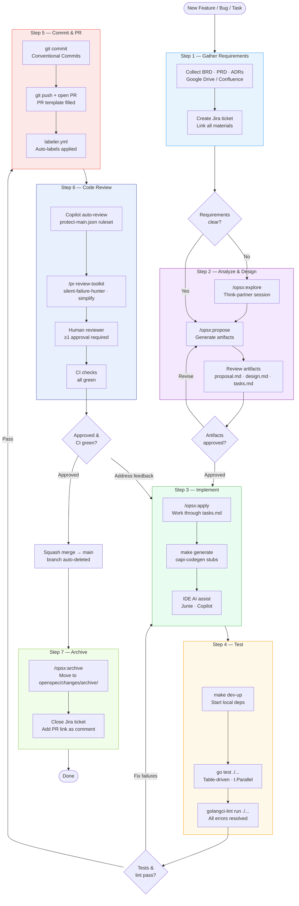

# AI-Augmented SDLC Guide

This guide explains how to set up your development environment and use AI tools to accelerate every phase of the software development lifecycle — from gathering requirements through to code review and archiving.

## Table of Contents

- [Overview](#overview)
- [Prerequisites](#prerequisites)
  - [1. Claude Code CLI](#1-claude-code-cli)
  - [2. OpenSpec](#2-openspec)
  - [3. oapi-codegen](#3-oapi-codegen)
  - [4. MCP Integrations](#4-mcp-integrations)
  - [5. IDE Setup](#5-ide-setup)
- [Development Process](#development-process)
  - [Step 1 — Gather Requirements](#step-1--gather-requirements)
  - [Step 2 — Analyze Requirements and Design](#step-2--analyze-requirements-and-design)
  - [Step 3 — Implementation](#step-3--implementation)
  - [Step 4 — Testing](#step-4--testing)
  - [Step 5 — Commit and Pull Request](#step-5--commit-and-pull-request)
  - [Step 6 — Code Review](#step-6--code-review)
  - [Step 7 — Archive](#step-7--archive)
- [Quick Reference](#quick-reference)

---

## Overview

This guide documents the team's AI-augmented SDLC. The workflow integrates Claude Code, OpenSpec, GitHub Copilot, Junie, and other tools to automate code generation, testing, review, and delivery — with humans remaining in control of requirements, acceptance, and architectural decisions.



---

## Prerequisites

### 1. Claude Code CLI

Claude Code is the primary AI coding agent. Install it and connect it to your project.

**Install**

```bash
npm install -g @anthropic-ai/claude-code
```

**Verify**

```bash
claude --version
```

**Authenticate**

```bash
claude auth login
```

Follow the browser prompt to complete OAuth authentication with your Anthropic account.

**Configure the project**

Claude Code reads its project-level settings from `.claude/settings.json`. The file in this repository is pre-configured with broad permissions for local development:

```json
{
  "version": "1.0.0",
  "permissions": {
    "allow": ["Bash(*)", "Read(*)", "Write(*)", "Edit(*)"],
    "deny": []
  }
}
```

> [!WARNING]
> The default configuration grants Claude broad access (`Bash(*)`, `Read(*)`, `Write(*)`). This is intentional for local development but is a significant blast radius if a prompt is misinterpreted. Tighten the `deny` list — for example, deny `Bash(rm *)`, `Bash(git push *)`, or restrict `Write` to specific directories — before using this configuration in shared, staging, or production environments.

---

### 2. OpenSpec

OpenSpec is the spec-driven workflow tool that creates and manages change artifacts (proposal, design, tasks).

**Install**

```bash
npm install -g openspec
```

**Configure the project**

The repository ships with a pre-configured `openspec/config.yaml`. Review and update the `context` field to match your project name and tech stack before use.

---

### 3. oapi-codegen

`oapi-codegen` generates Go server stubs and client code from OpenAPI 3.x specifications.

**Install**

```bash
go install github.com/oapi-codegen/oapi-codegen/v2/cmd/oapi-codegen@latest
```

**Verify**

```bash
oapi-codegen --version
```

**Usage**

The OpenAPI specification lives at `src/api/openapi.yaml`. Run code generation via the Makefile target:

```bash
cd src && make generate
```

> If a `generate` target does not yet exist, add it to `src/Makefile` pointing to your `oapi-codegen` configuration file.

---

### 4. MCP Integrations

Claude Code connects to external tools via the Model Context Protocol (MCP). Configure all required integrations in your Claude Code session before starting any workflow that queries them.

#### Required integrations

| Integration | Purpose | Reference |
|---|---|---|
| **Jira** | Read and update tickets, sprint data, blockers | [mcp-atlassian](https://github.com/sooperset/mcp-atlassian) |
| **Confluence** | Read and write design docs, ADRs, meeting notes | [mcp-atlassian](https://github.com/sooperset/mcp-atlassian) (same server) |
| **GitHub** | Create commits, open PRs, trigger CI, read PR reviews | [github-mcp-server](https://github.com/github/github-mcp-server) |
| **Slack** | Send summaries and notifications | [Slack MCP server](https://github.com/modelcontextprotocol/servers/tree/main/src/slack) |
| **Google Drive** | Read BRDs, PRDs, and other shared documents | [Google Drive MCP server](https://github.com/modelcontextprotocol/servers/tree/main/src/gdrive) |
| **Google Calendar** | Read sprint ceremonies, release dates, and deadlines | [Google Calendar MCP server](https://github.com/modelcontextprotocol/servers/tree/main/src/gcal) |

#### Connecting an integration

Add each server to your Claude Code MCP configuration:

```bash
claude mcp add <server-name> <command> [args...]
```

Example for the Atlassian server:

```bash
claude mcp add atlassian npx mcp-atlassian \
  --jira-url https://your-org.atlassian.net \
  --confluence-url https://your-org.atlassian.net/wiki
```

Consult each server's README for authentication details (API tokens, OAuth apps, etc.).

#### Verifying integrations

List connected integrations:

```bash
claude mcp list
```

---

### 5. IDE Setup

#### GoLand + Junie

1. Install [GoLand](https://www.jetbrains.com/go/).
2. Install the [Junie plugin](https://www.jetbrains.com/junie/) from the JetBrains Marketplace.
3. Open the `src/` directory as your project root.
4. Configure the GOPATH and Go SDK inside **Settings → Go → GOROOT**.

Junie reads the project instructions from `JUNIE.md` at the repository root. Keep this file up to date.

#### Visual Studio Code + GitHub Copilot

1. Install [Visual Studio Code](https://code.visualstudio.com/).
2. Install the [GitHub Copilot extension](https://marketplace.visualstudio.com/items?itemName=GitHub.copilot).
3. Sign in with your GitHub account that has an active Copilot license.
4. Open the repository root as your workspace.

GitHub Copilot reads its project instructions from `.github/copilot-instructions.md`.

#### Optional tools

| Tool | Purpose |
|---|---|
| [Codex CLI](https://github.com/openai/codex) | OpenAI code generation agent (alternative to Claude Code) |
| [Cursor](https://www.cursor.com/) | AI-native editor using `.cursorrules` from this repository |

---

## Development Process

The full AI-augmented workflow maps to these steps:

```
1. Gather requirements
2. Analyze requirements and design   ← Claude Code /opsx:explore + /opsx:propose
3. Implement                         ← Claude Code /opsx:apply + IDE
4. Test                              ← Claude Code / Junie / Copilot
5. Commit and open PR               ← git + GitHub
6. Code review                       ← GitHub Copilot review + human review
7. Archive                           ← Claude Code /opsx:archive
```

---

### Step 1 — Gather Requirements

**Goal**: collect all available context for the feature or fix before any AI session begins.

#### 1.1 — Collect source materials

Gather the following materials and save links or copies where your team stores shared documents:

| Material | Where to look |
|---|---|
| Business Requirements Document (BRD) | Google Drive, Confluence |
| Product Requirements Document (PRD) | Google Drive, Confluence |
| High-level design / system design | Confluence, architecture docs |
| Tech stack & ADRs | `docs/architecture.md`, Confluence |
| Internal API specifications | `src/api/openapi.yaml`, Confluence |
| External API specifications | vendor docs, shared Drive folder |

#### 1.2 — Create a Jira ticket

1. Open Jira and create a new ticket in the relevant project board.
2. Set the ticket type (Story, Task, Bug, etc.) and priority.
3. Paste the raw requirement in the **Description** field.
4. Link all relevant materials using the **Link** field or description:
   - Confluence pages (BRD, PRD, design docs)
   - Google Drive documents
   - Related Jira epics or parent stories
5. Assign the ticket to yourself and move it to **Backlog** or **In Progress** as appropriate.

**Ticket naming convention**: use a clear, imperative title that describes the outcome.
Example: `Add user authentication via OAuth2`.

> **Tip — create the ticket with AI**: Once your Atlassian MCP is configured (see [Section 4](#4-mcp-integrations)), you can have Claude create and link the ticket for you instead of doing it manually:
> ```
> Create a Jira Story in board DOP titled "Add OAuth2 login via Google identity provider".
> Set priority to High and link the PRD at <confluence-url>.
> ```

---

### Step 2 — Analyze Requirements and Design

**Goal**: use AI to produce a structured proposal, detailed design, and implementation task list from the gathered requirements.

#### 2.1 — (Optional) Explore first with `/opsx:explore`

If the requirements are ambiguous or you want to think through options before committing to a design, start an exploration session:

```
/opsx:explore
```

Claude will act as a thinking partner: asking clarifying questions, exploring trade-offs, and helping you refine the problem statement before design begins.

#### 2.2 — Propose the change with `/opsx:propose`

Open a Claude Code session and run:

```
/opsx:propose
```

Claude will:
1. Ask what you want to build (or infer it from context).
2. Derive a kebab-case change name (e.g., `add-oauth2-auth`).
3. Run `openspec new change "<name>"` to scaffold the change directory.
4. Generate artifacts in dependency order:
   - **`proposal.md`** — what and why (scope, goals, non-goals)
   - **`design.md`** — how (architecture, data model, API contract, component interactions)
   - **`tasks.md`** — numbered, time-boxed implementation tasks with acceptance criteria
5. Show a final status summary when all artifacts are ready.

**Tip**: Attach the Jira ticket URL and any relevant Confluence pages in your prompt so Claude has the full context:

```
/opsx:propose

Context:
- Jira ticket: https://your-org.atlassian.net/browse/AGI-123
- PRD: https://your-org.atlassian.net/wiki/...
- We want to add OAuth2 login using Google as the identity provider.
```

#### 2.3 — Review and approve the artifacts

Before implementation begins, review each artifact:

| Artifact | What to check |
|---|---|
| `proposal.md` | Scope is correct; non-goals are explicit; stakeholder sign-off if required |
| `design.md` | Architecture follows the layering rules in `AGENTS.md`; no forbidden dependencies |
| `tasks.md` | Tasks are small enough (≤ 2 hours each); acceptance criteria are clear and testable |

Edit any file directly if adjustments are needed — Claude will read the updated versions in subsequent steps.

---

### Step 3 — Implementation

**Goal**: use AI agents to write the code, following the task list generated in Step 2.

#### 3.1 — Run `/opsx:apply`

```
/opsx:apply
```

Claude will:
1. Read the context files (`proposal.md`, `design.md`, `tasks.md`).
2. Display current progress (`N/M tasks complete`).
3. Implement each pending task in sequence, marking `- [ ]` → `- [x]` as each is completed.
4. Pause and ask for guidance if a task is unclear or an implementation issue arises.

**Tip**: keep the Claude Code session open throughout implementation. You can interrupt at any time by simply typing your question or instruction.

#### 3.2 — Generate API code with `oapi-codegen`

If the change adds or modifies API endpoints, regenerate the Go server stubs after updating `src/api/openapi.yaml`:

```bash
cd src && make generate
```

Commit the regenerated files alongside the hand-written implementation code.

#### 3.3 — IDE assistance

Use your IDE's AI features for focused, in-file assistance during implementation:

| IDE | AI feature | Best used for |
|---|---|---|
| GoLand | Junie | Single-file inline edits, refactoring, and test generation without leaving the IDE |
| VS Code | GitHub Copilot | Agentic multi-file edits, cross-file refactors via chat, and PR-level code review |

Both tools read the project instruction files (`JUNIE.md`, `.github/copilot-instructions.md`) to stay aligned with team conventions.

---

### Step 4 — Testing

**Goal**: ensure the implementation is covered by automated tests before the PR is opened.

#### 4.1 — Generate tests with AI

Ask Claude Code (or your IDE AI) to generate tests for the code written in Step 3:

```
Write unit tests for the new OAuth2 handler in internal/handler/auth.go.
Cover the happy path, invalid token, and expired token cases.
```

Follow the testing conventions in `AGENTS.md`:
- Table-driven tests with `t.Run` subtests.
- `give` / `want` field naming.
- `t.Parallel()` on independent tests.
- `require.ErrorIs` / `require.Equal` for assertions.

#### 4.2 — Start local dependencies

Many services depend on MariaDB, Redis, or Kafka. Start them before running tests:

```bash
make dev-up
```

This spins up the containers defined in `docker/docker-compose.dev.yml`. Run `make dev-down` when you are done to tear them down.

#### 4.3 — Run the tests

```bash
cd src && go test ./...
```

Or use the Makefile target if one is defined:

```bash
cd src && make test
```

Fix any failures before proceeding to Step 5. If a failure reveals a design issue, return to Step 2 and update the artifacts accordingly.

#### 4.4 — Run the linter

```bash
cd src && golangci-lint run ./...
```

Or via the Makefile:

```bash
cd src && make lint
```

All lint errors must be resolved before the PR is opened.

---

### Step 5 — Commit and Pull Request

**Goal**: commit the changes and open a pull request following team conventions.

#### 5.1 — Create the commit

Use [Conventional Commits](https://www.conventionalcommits.org/) format:

```bash
# Stage specific files — avoid git add . to prevent accidentally committing
# secrets, .env files, or large generated binaries.
git add src/ openspec/
git commit -m "feat(auth): add OAuth2 login via Google identity provider"
```

Common prefixes:

| Prefix | Use when |
|---|---|
| `feat:` | Adding a new feature |
| `fix:` | Fixing a bug |
| `docs:` | Documentation changes only |
| `refactor:` | Code restructuring without behaviour change |
| `test:` | Adding or updating tests |
| `chore:` | Tooling, CI, dependency updates |

#### 5.2 — Push and open the PR

```bash
git push origin feat/AGI-123
```

Open the pull request on GitHub. Use the PR title format:

```
AGI-123: Add OAuth2 login via Google identity provider
```

Fill in all sections of `.github/PULL_REQUEST_TEMPLATE.md`:
- **Motivation / problem statement**
- **What changed**
- **How to test**
- **Migration / rollout notes** (schema changes, feature flags, deployment steps)

#### 5.3 — Automatic labelling

The `.github/workflows/labeler.yml` workflow automatically applies labels to the PR based on the branch name and changed files. No manual action required — verify the labels look correct after the workflow runs.

---

### Step 6 — Code Review

**Goal**: validate the change is correct, safe, and follows team conventions before merging.

#### 6.1 — Claude Code review skills (optional, before opening the PR)

Before requesting human review, use the built-in review skills inside Claude Code to catch common issues early:

```
/pr-review-toolkit:review-pr
```

Specialist sub-skills that run automatically as part of the toolkit, or can be invoked individually:

| Skill | What it catches |
|---|---|
| `pr-review-toolkit:silent-failure-hunter` | Silent failures, swallowed errors, inappropriate fallback behaviour |
| `pr-review-toolkit:code-simplifier` | Over-engineered code, unnecessary complexity |
| `pr-review-toolkit:code-reviewer` | Style violations, AGENTS.md guideline breaches |

#### 6.2 — GitHub Copilot review (automatic)

The `.github/rulesets/protect-main.json` ruleset configures GitHub to **automatically request a Copilot code review** on every new push and draft PR. Copilot will post inline comments and a summary review within a few minutes of the PR being opened.

Review the Copilot feedback and address any comments you agree with before requesting human review.

#### 6.3 — Human review

Assign the PR to a team reviewer. The branch ruleset requires **at least one approval** before merging.

Reviewers should verify:
- Business logic matches the Jira ticket and `proposal.md`.
- Architecture follows the layering rules in `AGENTS.md`.
- Tests cover the new or changed behaviour.
- No secrets, credentials, or PII are committed.

#### 6.4 — Fix review feedback

For code-level feedback, use Claude Code or your IDE AI to apply fixes quickly:

```
The reviewer flagged that the handler is calling the repository directly.
Fix it by routing the call through the domain service instead.
```

After making changes, push the updated branch — CI will re-run automatically and Copilot will review the new push.

#### 6.5 — Merge

Once approved and all CI checks pass, merge the PR. The branch ruleset restricts merging to **squash only** — GitHub will squash all commits into a single commit on `main`.

The head branch is automatically deleted after merge.

---

### Step 7 — Archive

**Goal**: close out the OpenSpec change once the PR is merged.

#### 7.1 — Run `/opsx:archive`

```
/opsx:archive
```

Claude will:
1. Check artifact completion status and warn if any are incomplete.
2. Check task completion (`- [x]` vs `- [ ]`) and warn if tasks remain.
3. Assess whether delta specs need to be synced back to the main spec files.
4. Move the change directory to `openspec/changes/archive/YYYY-MM-DD-<name>/`.
5. Display a summary of the archive operation.

#### 7.2 — Update the Jira ticket

Move the Jira ticket to **Done** (or the equivalent closed status on your board). Add a comment with the PR link for traceability.

---

## Quick Reference

| Step | Command / Action |
|---|---|
| Explore requirements | `claude` → `/opsx:explore` |
| Propose change | `claude` → `/opsx:propose` |
| Implement change | `claude` → `/opsx:apply` |
| Regenerate API stubs | `cd src && make generate` |
| Run tests | `cd src && go test ./...` |
| Run linter | `cd src && golangci-lint run ./...` |
| Create commit | `git commit -m "feat(scope): description"` |
| Open PR | `git push origin feat/TICKET-ID` then open on GitHub |
| Archive change | `claude` → `/opsx:archive` |

### Useful skills and commands

| Skill / Command | Purpose |
|---|---|
| `/opsx:explore` | Think through ideas before proposing a change |
| `/opsx:propose` | Generate proposal, design, and task artifacts |
| `/opsx:apply` | Implement tasks from an active change |
| `/opsx:archive` | Archive a completed change |
| `/pr-review-toolkit:review-pr` | Full PR review using specialist sub-agents |
| `/pr-review-toolkit:silent-failure-hunter` | Hunt for swallowed errors and silent failures |
| `/pr-review-toolkit:code-simplifier` | Simplify over-engineered code |
| `/project-status-summary` | Generate a project health report from Jira, Confluence, Slack |
| `/weekly-bottleneck-report` | Generate a sprint bottleneck and delay report |
| `/estimate-release` | Estimate the release date for a single Jira ticket |

See [README.md](../README.md#using-claude-code-skills) for full documentation of each skill.
