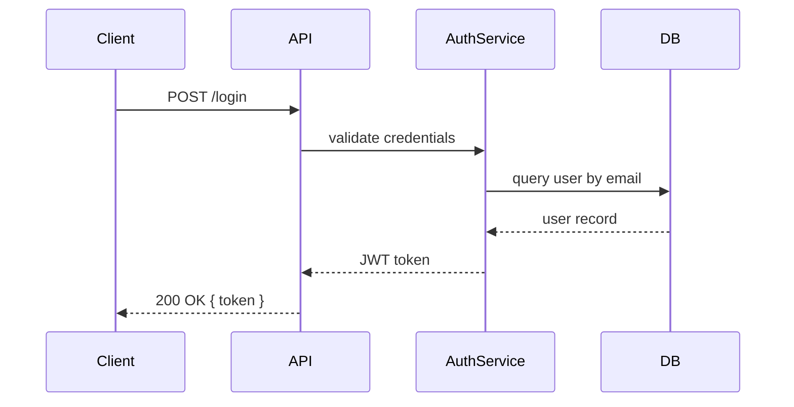
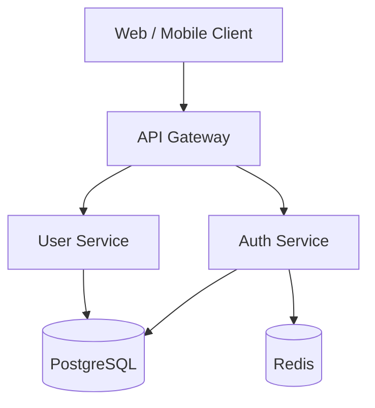
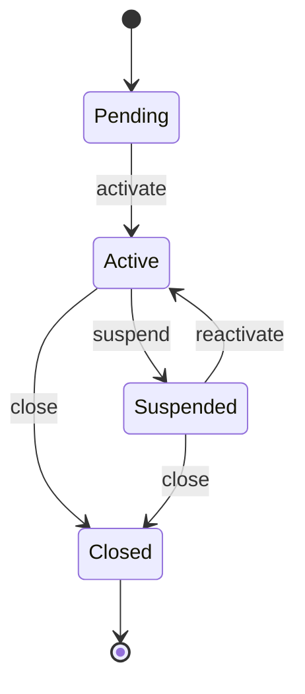
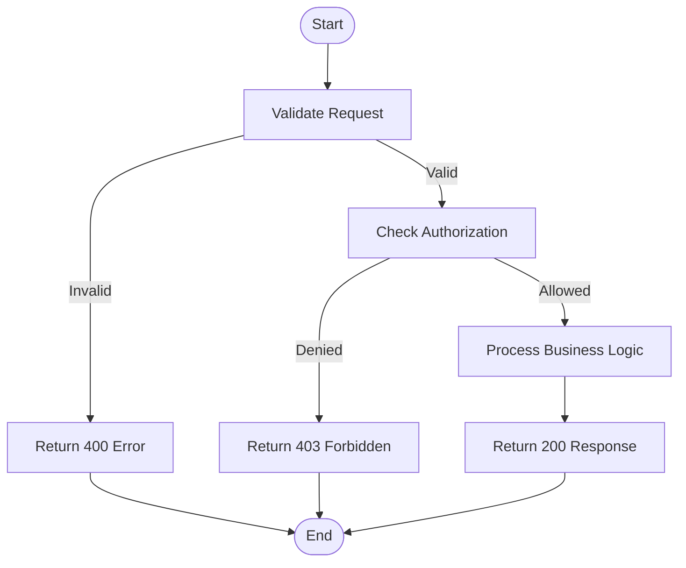
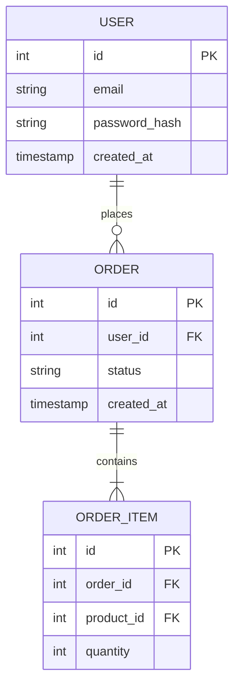
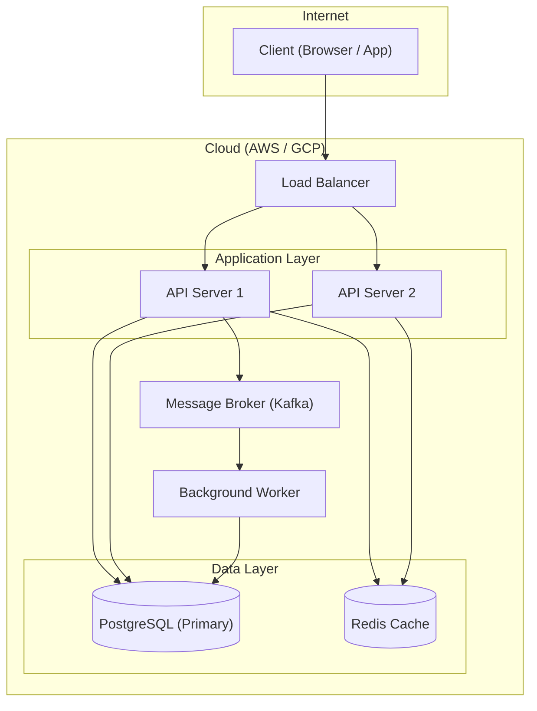

# Diagram Conventions

> **When generating or reviewing diagrams for system design or architecture documentation, read this file first.**
>
> These guidelines apply to all diagrams produced in design documents, architecture reviews, and API/flow documentation.

---

## Table of Contents

- [Format](#format)
- [Diagram Type Selection](#diagram-type-selection)
- [When to Generate Diagrams](#when-to-generate-diagrams)
- [Quick-Reference Table](#quick-reference-table)
- [Examples](#examples)

---

## Format

- All diagrams must be written in either **Mermaid** or **PlantUML** format.
- **Prefer Mermaid** unless the context specifically calls for PlantUML (e.g. a platform or tool that only renders PlantUML).
- Embed diagrams directly in Markdown files using fenced code blocks:
  - Mermaid: ` ```mermaid `
  - PlantUML: ` ```plantuml `
- Do not use image files (PNG/SVG) as a substitute for source-format diagrams — always commit the textual source so diagrams remain version-controlled and diff-able.

---

## Diagram Type Selection

Choose the diagram type that best matches the view you need to communicate:

| Diagram Type | View | Best Usage |
|---|---|---|
| Sequence | Dynamic | API flow, service-to-service interaction, message ordering |
| C4 / Component | Structural | High-level architecture, bounded contexts, component relationships |
| Deployment | Physical | Cloud topology, network setup, infrastructure layout |
| ER (Entity-Relationship) | Data | Database schema, data model relationships |
| Activity | Dynamic | Business process flows, decision trees, parallel actions |
| State / State Transition | Behavioural | Entity lifecycle, state machine logic |

---

## When to Generate Diagrams

When performing **system design** or **high-level architecture design**, generate the relevant diagrams alongside the written description. Include a diagram whenever it communicates structure or behaviour more clearly than prose alone.

Typical triggers:

- Designing a new service or module → **C4 / Component diagram**
- Describing an API call flow or inter-service communication → **Sequence diagram**
- Modelling an entity lifecycle or workflow state machine → **State / State Transition diagram** or **Activity diagram**
- Defining or modifying the database schema → **ER diagram**
- Describing cloud or network infrastructure → **Deployment diagram**

You do not need to generate all diagram types for every task — choose the ones that are necessary and meaningful for the context.

---

## Quick-Reference Table

| Diagram | View Type | Best Usage |
|---|---|---|
| Sequence | Dynamic | API Flow / Interaction |
| C4 / Component | Structural | High-level Architecture |
| Deployment | Physical | Cloud / Network Setup |
| ER | Data | Database Schema |
| Activity | Dynamic | Business Process / Decision Flow |
| State | Behavioural | Entity Lifecycle / State Machine |

---

## Examples

### Sequence Diagram (Mermaid)



### Component Diagram (Mermaid C4)



### State Transition Diagram (Mermaid)



### Activity Diagram (Mermaid)



### ER Diagram (Mermaid)



### Deployment Diagram (Mermaid)


