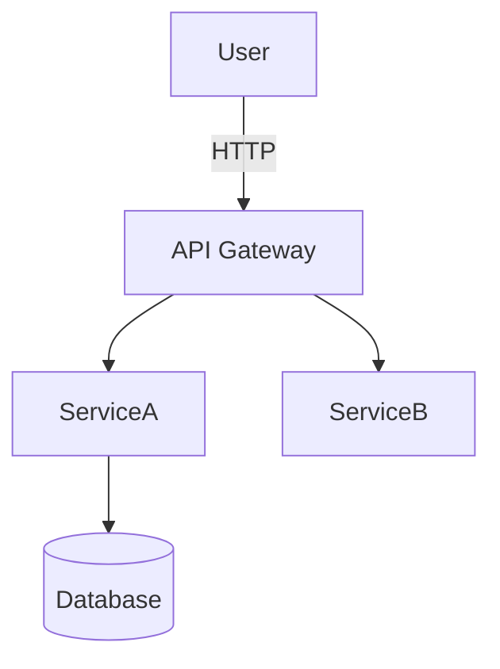
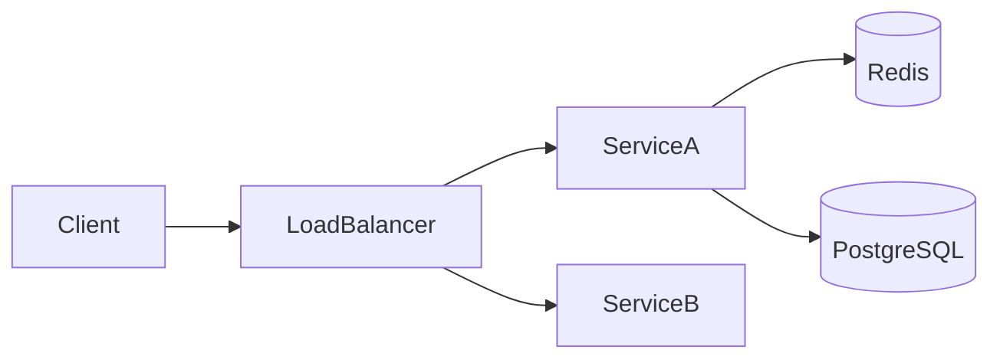
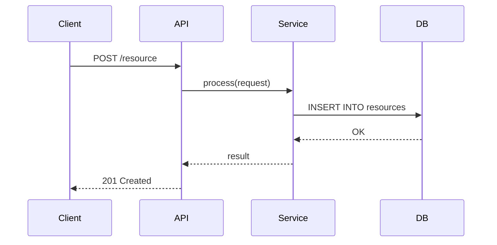
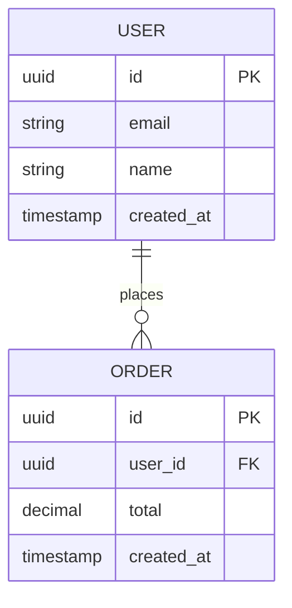

# HLD-XX: \<Title\>

| Field | Value |
|-------|-------|
| **HLD Number** | HLD-XX |
| **Title** | \<Short, descriptive title — e.g. "User Authentication Service"\> |
| **Status** | `draft` |
| **Author(s)** | \<Name / GitHub handle\> |
| **Created On** | YYYY-MM-DD |
| **Last Updated** | YYYY-MM-DD |
| **Related ADRs** | — |
| **Related HLDs** | — |

---

## Table of Contents

- [Overview](#overview)
- [Goals & Non-Goals](#goals--non-goals)
- [System Context](#system-context)
- [Architecture](#architecture)
- [Components](#components)
- [Data Flow](#data-flow)
- [Data Model](#data-model)
- [API Contract](#api-contract)
- [Non-Functional Requirements](#non-functional-requirements)
- [Security Considerations](#security-considerations)
- [Open Questions](#open-questions)
- [Changelog](#changelog)

---

## Overview

<!--
Provide a concise description of the system, feature, or service being designed.
State the problem it solves and the high-level approach taken.
-->

## Goals & Non-Goals

### Goals

<!--
List the explicit objectives this design aims to achieve.
-->

-

### Non-Goals

<!--
List what is explicitly out of scope for this design.
-->

-

---

## System Context

<!--
Describe how this component fits into the broader system.
Include a context diagram (C4 Level 1 or equivalent) where applicable.

Example Mermaid context diagram:

-->

---

## Architecture

<!--
Describe the overall architecture of the solution.
Include a component diagram (C4 Level 2 or equivalent) where applicable.

Example Mermaid architecture diagram:

-->

---

## Components

<!--
Describe each major component, its responsibility, and its interactions.

| Component | Responsibility | Technology |
|-----------|---------------|------------|
| …         | …             | …          |
-->

---

## Data Flow

<!--
Describe the key data flows through the system.
Include sequence diagrams for the primary use cases where helpful.

Example Mermaid sequence diagram:

-->

---

## Data Model

<!--
Describe the key entities and their relationships.
Include an ER diagram where applicable.

Example Mermaid ER diagram:

-->

---

## API Contract

<!--
Summarize the key API endpoints exposed or consumed by this design.
Reference the full OpenAPI spec if one exists.

| Method | Path | Description |
|--------|------|-------------|
| …      | …    | …           |
-->

---

## Non-Functional Requirements

<!--
Document measurable non-functional requirements for this design.

| Category | Requirement |
|----------|-------------|
| Performance | … |
| Scalability | … |
| Availability | … |
| Observability | … |
-->

---

## Security Considerations

<!--
Describe security-relevant decisions, threat model excerpts, and mitigations.
-->

-

---

## Open Questions

<!--
List unresolved questions or decisions that still need to be made.
Remove entries once resolved, or link to the ADR / decision that resolved them.

| # | Question | Owner | Due |
|---|----------|-------|-----|
| 1 | … | … | YYYY-MM-DD |
-->

---

## Changelog

| Date | Author | Change |
|------|--------|--------|
| YYYY-MM-DD | \<Author\> | Initial draft |
