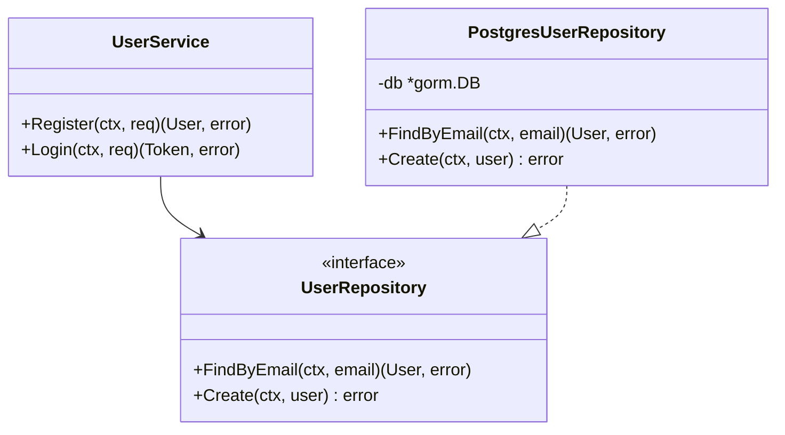
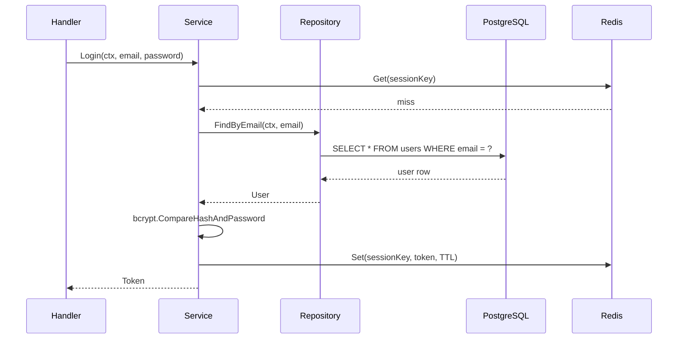

# LLD-XX: \<Title\>

| Field | Value |
|-------|-------|
| **LLD Number** | LLD-XX |
| **Title** | \<Short, descriptive title — e.g. "User Authentication Service — Internal Design"\> |
| **Status** | `draft` |
| **Author(s)** | \<Name / GitHub handle\> |
| **Created On** | YYYY-MM-DD |
| **Last Updated** | YYYY-MM-DD |
| **Related HLD** | — |
| **Related ADRs** | — |

---

## Table of Contents

- [Overview](#overview)
- [Goals & Non-Goals](#goals--non-goals)
- [Module Structure](#module-structure)
- [Class / Type Design](#class--type-design)
- [Sequence Diagrams](#sequence-diagrams)
- [Error Handling](#error-handling)
- [Configuration & Environment](#configuration--environment)
- [Testing Strategy](#testing-strategy)
- [Open Questions](#open-questions)
- [Changelog](#changelog)

---

## Overview

<!--
Provide a concise description of the component or module being designed at the implementation level.
Reference the parent HLD where applicable.
State the specific technical problem being solved and the approach taken.
-->

---

## Goals & Non-Goals

### Goals

<!--
List the explicit implementation-level objectives this design aims to achieve.
-->

-

### Non-Goals

<!--
List what is explicitly out of scope for this low-level design.
-->

-

---

## Module Structure

<!--
Describe the internal package / directory layout and the responsibility of each unit.

Example:

```
internal/auth/
├── handler.go       # HTTP handler — validates input and delegates to service
├── service.go       # Business logic — orchestrates repository and token issuance
├── repository.go    # Database access — CRUD operations for users
├── model.go         # Domain types — User, Token, Claims
└── errors.go        # Sentinel errors — ErrNotFound, ErrUnauthorised
```
-->

---

## Class / Type Design

<!--
Describe key types, interfaces, and their relationships.
Include a class or type diagram where helpful.

Example Mermaid class diagram:



List each key interface and struct with its fields and methods.
-->

---

## Sequence Diagrams

<!--
Provide detailed sequence diagrams for the primary flows within this component.
Focus on internal interactions — function calls, goroutines, database queries, cache hits/misses.

Example Mermaid sequence diagram:


-->

---

## Error Handling

<!--
Describe how errors are created, wrapped, and propagated through this module.
List sentinel errors and the HTTP status codes they map to.

| Error | Description | HTTP Status |
|-------|-------------|-------------|
| ErrNotFound | Entity does not exist | 404 |
| ErrUnauthorised | Invalid credentials | 401 |
| ErrConflict | Duplicate entry | 409 |
-->

---

## Configuration & Environment

<!--
List all environment variables or configuration keys consumed by this module.

| Key | Type | Default | Description |
|-----|------|---------|-------------|
| AUTH_TOKEN_TTL | duration | 24h | Lifetime of a session token |
| AUTH_SECRET | string | — | Secret used to sign tokens (required) |
-->

---

## Testing Strategy

<!--
Describe the approach to testing this module.

| Layer | Type | Tool | Notes |
|-------|------|------|-------|
| Repository | Integration | testcontainers | Runs against a real PostgreSQL container |
| Service | Unit | go test | Uses mock repository (mockery) |
| Handler | Unit | httptest | Uses mock service |
-->

---

## Open Questions

<!--
List unresolved questions or implementation decisions that still need to be made.
Remove entries once resolved, or link to the ADR / decision that resolved them.

| # | Question | Owner | Due |
|---|----------|-------|-----|
| 1 | … | … | YYYY-MM-DD |
-->

---

## Changelog

| Date | Author | Change |
|------|--------|--------|
| YYYY-MM-DD | \<Author\> | Initial draft |
